# ERPConnect

**ERPConnect** is a Flask-based ERP-style application for managing vendors, invoices, dashboards, and reporting workflows.

> 🚀 Inspired by SAP S/4HANA concepts and Fiori design patterns, this app simulates real-world ERP logic in a simplified, accessible format for business analytics, vendor management, and financial reporting.

---

## 📸 Screenshots

| **Login Page** | **Register Page** | **Dashboard Overview** |
|----------------|-------------------|-------------------------|
| 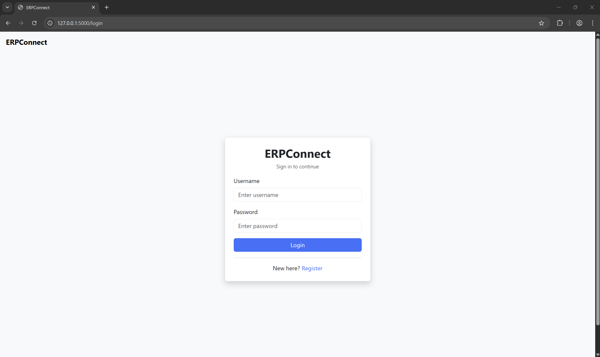 | 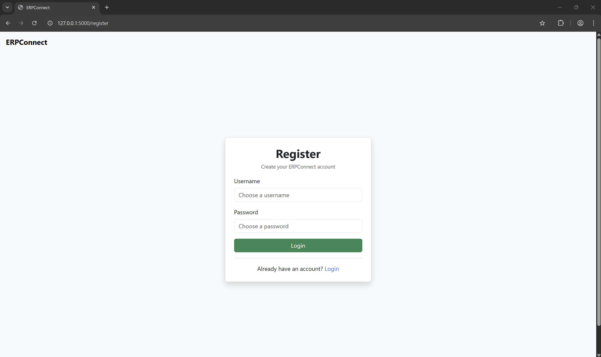 | 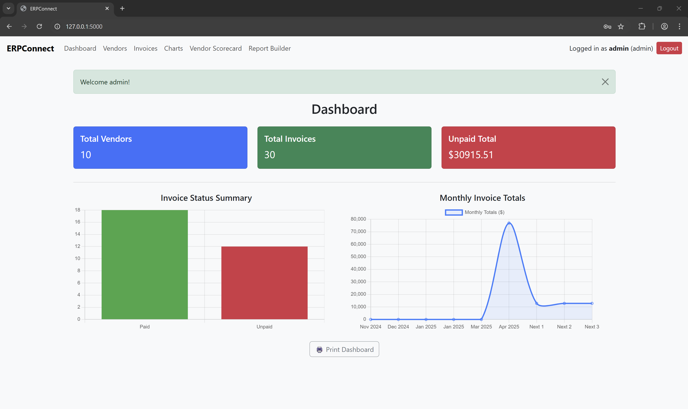 |

| **Vendor List** | **Add Vendor** | **Invoices Overview** |
|-----------------|----------------|------------------------|
| 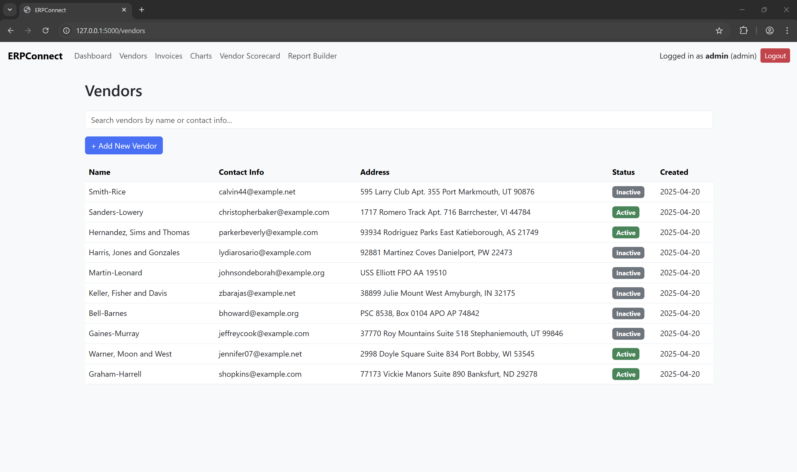 | 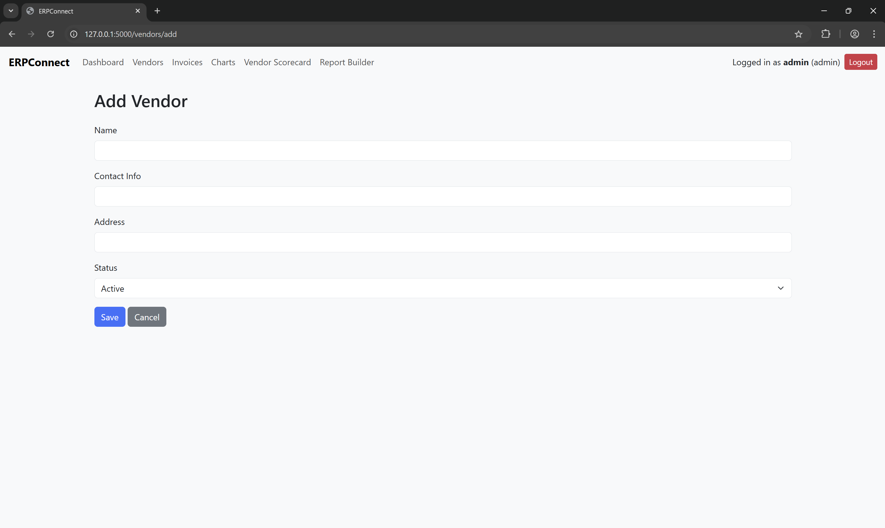 | 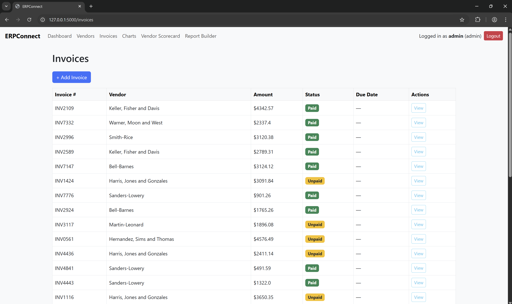 |

| **Invoice Detail** | **Add Invoice** | **Analytics / Charts** |
|--------------------|-----------------|-------------------------|
| 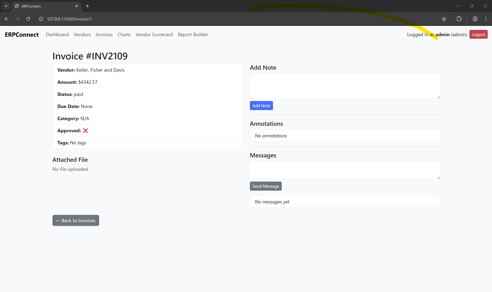 | 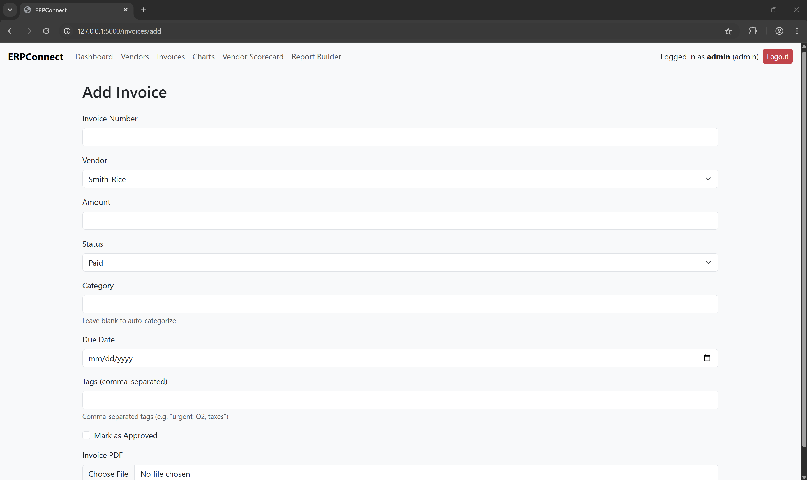 | 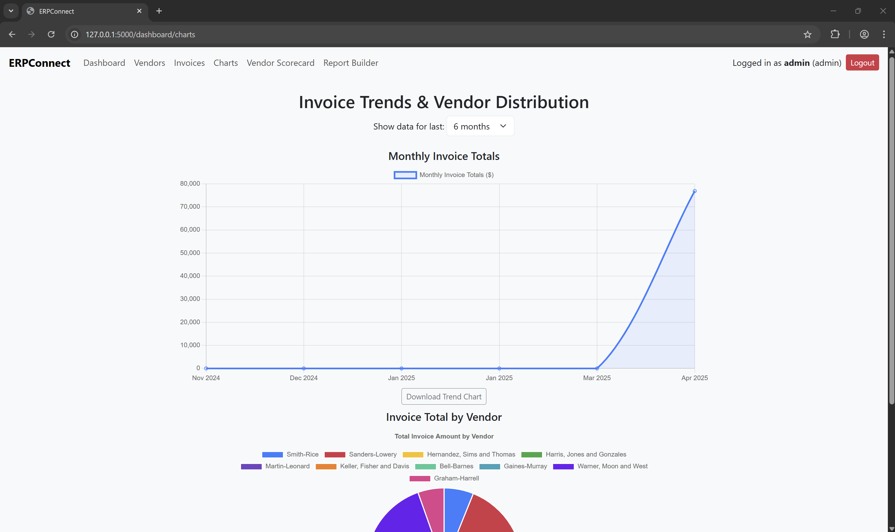 |

| **Report Builder** | **Report Results** | **Vendor Scorecard** |
|--------------------|--------------------|-----------------------|
| 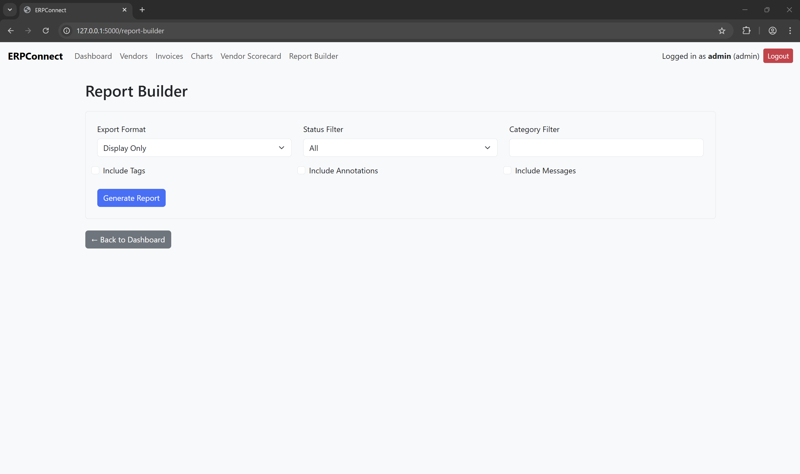 | 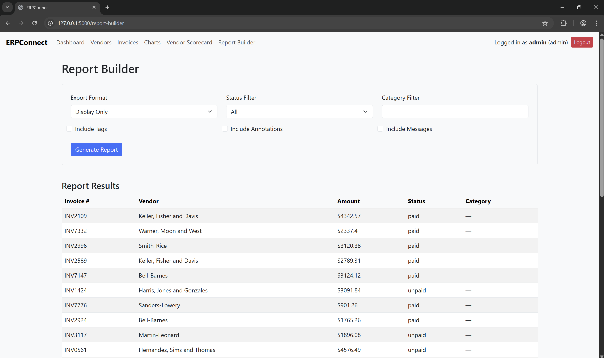 | 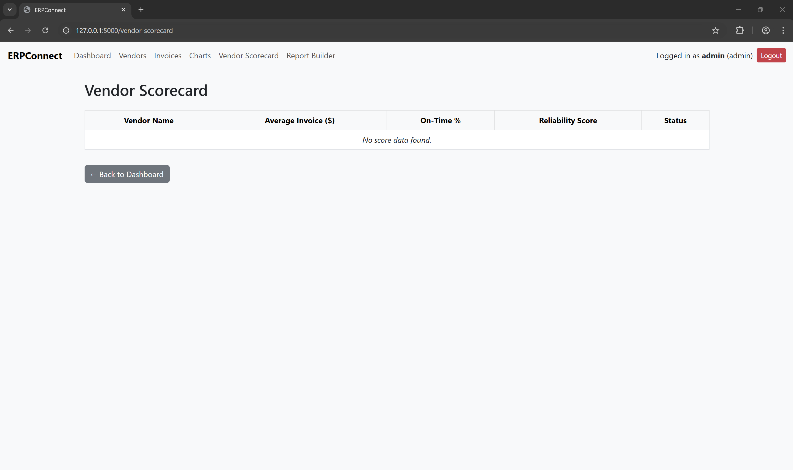 |

---

## 🧠 Business Problem Solved

Managing vendor and invoice workflows across departments is often slow, siloed, and prone to manual errors.  
**ERPConnect** helps demonstrate how digitizing and integrating this process — similar to SAP ERP — can:

- Streamline approvals
- Improve financial visibility
- Support role-based access
- Enable dynamic reporting & forecasting

---

## 🔧 Features

- 🔐 Admin & Viewer login
- 🧾 Vendor and Invoice CRUD
- 📊 Dashboard KPIs + Chart.js visualizations
- 🔍 Invoice filters by date, status, vendor
- 📥 Upload PDFs, view & annotate invoices
- 📤 Export CSV, Excel, PDF reports
- 🧑‍💼 Vendor scorecards
- 🔁 Automated reminders (via APScheduler)
- 🔎 Search & tagging
- 📂 Report builder with export options

---

## 🚀 Technologies Used

| Stack        | Tools / Frameworks            |
|--------------|-------------------------------|
| **Backend**  | Python, Flask, SQLAlchemy     |
| **Frontend** | Bootstrap, Jinja2, Chart.js   |
| **Database** | SQLite                        |
| **Scheduling** | APScheduler                  |
| **Exporting** | pandas, openpyxl, pdfkit     |
| **Deployment** | Render + GitHub              |

---

## 🛠️ How to Use (Locally)

1. **Clone the repo**  
   `git clone https://github.com/asif-imtiaz-j/erpconnect.git`

2. **Create virtual environment**  
   `python -m venv venv && venv\Scripts\activate`

3. **Install dependencies**  
   `pip install -r requirements.txt`

4. **Run database migrations**  
   `flask db upgrade`

5. **Seed data & admin**  
   `python seed_data.py && python create_admin.py`

6. **Run app**  
   `flask run`

---

## 🌐 Live Demo

🔗 Deployed on Render:  
👉 [https://erpconnect.onrender.com](https://erpconnect.onrender.com)

Use credentials like:  
- Username: `admin`  
- Password: `admin123`

---

## 📦 Project Status

This is an active portfolio project. Future versions may include:
- SAP-like module plug-ins
- API endpoints
- Integration with external services